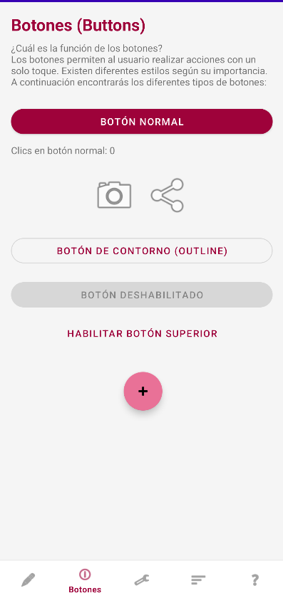
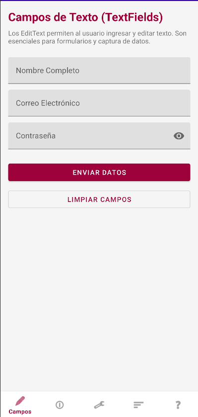
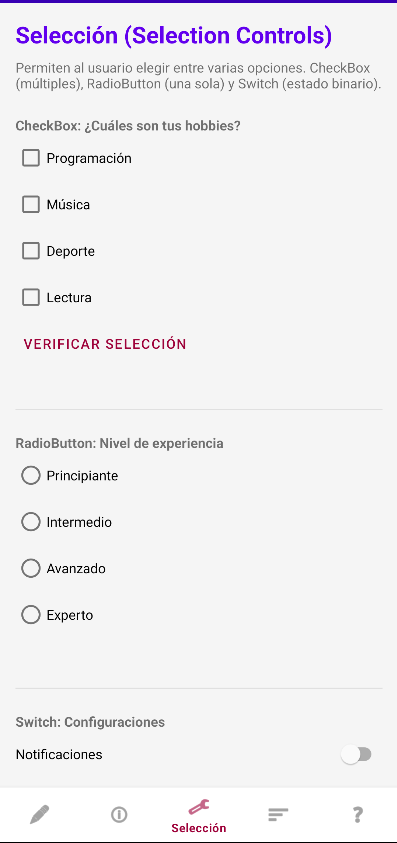
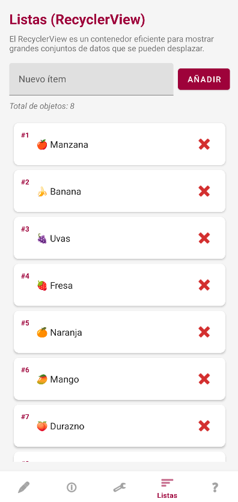
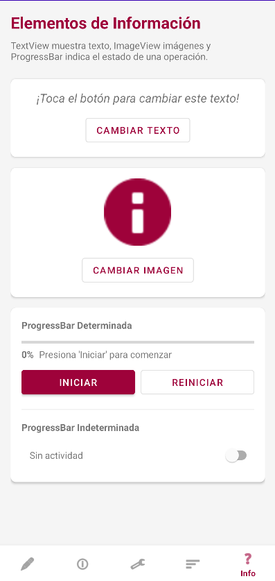

# Elementos Básicos Android Studio

## Descripción de la aplicación

**Elementos Básicos Android Studio** es una aplicación de ejemplo desarrollada con **Android Studio y Kotlin** cuyo objetivo es mostrar y probar algunos de los componentes básicos de la interfaz de usuario (UI) disponibles en Android.

La aplicación funciona como una demostración práctica de elementos visuales y de interacción que se utilizan comúnmente en el desarrollo de aplicaciones móviles.

Entre los elementos que pueden encontrarse en la aplicación se incluyen:

- Botones (Button)
- Campos de texto (EditText)
- Barras de progreso (ProgressBar)
- Etiquetas de texto (TextView)
- Otros componentes básicos de interfaz

Este proyecto está pensado principalmente como **ejercicio de aprendizaje** o **referencia básica** para comprender cómo integrar y utilizar componentes de UI en Android utilizando Kotlin.

---

## Tecnologías utilizadas

- Kotlin  
- Android Studio  
- Android SDK  
- XML para diseño de interfaces  

---

## Estructura del proyecto

El proyecto sigue la estructura estándar de aplicaciones Android:

```

Elementos_Basicos_Android_Studio
│
├── app
│   ├── java / kotlin
│   │   └── Código fuente de la aplicación
│   │
│   ├── res
│   │   ├── layout        → Diseños XML de las pantallas
│   │   ├── drawable      → Recursos gráficos
│   │   ├── values        → Colores, strings y estilos
│   │
│   └── AndroidManifest.xml
│
├── gradle
└── build.gradle

````

---

# Instrucciones de instalación

## 1. Clonar el repositorio

```bash
git clone https://github.com/WilliamsZeppeli/Elementos_Basicos_Android_Studio.git
````

## 2. Abrir el proyecto en Android Studio

1. Abrir **Android Studio**
2. Seleccionar **Open an existing project**
3. Elegir la carpeta del repositorio clonado
4. Esperar a que **Gradle sincronice el proyecto**

## 3. Ejecutar la aplicación

1. Conectar un **dispositivo Android** o iniciar un **emulador**
2. Presionar el botón **Run (▶)**
3. Seleccionar el dispositivo
4. La aplicación se compilará y ejecutará automáticamente

---

# Instrucciones de uso de la aplicación

Una vez que la aplicación se ejecuta en el dispositivo o emulador, el usuario podrá interactuar con los distintos elementos de interfaz incluidos en la app.

### Uso básico

1. **Campos de texto (EditText)**
   Permiten introducir información o texto que será procesado por la aplicación.

2. **Botones (Button)**
   Al presionar los botones se ejecutan diferentes acciones definidas en el código Kotlin, como mostrar mensajes o activar otros componentes de la interfaz.

3. **TextView**
   Muestran información o resultados generados por la aplicación.

4. **ProgressBar**
   Representa visualmente el progreso de una acción o proceso dentro de la aplicación.

### Interacción general

* Introducir datos en los campos de texto si la interfaz lo solicita.
* Presionar los botones para ejecutar las acciones programadas.
* Observar cómo los distintos componentes de la interfaz reaccionan a la interacción del usuario.

La aplicación está diseñada para **demostrar el funcionamiento básico de estos componentes**, por lo que sirve como referencia para aprender cómo se comportan dentro de una aplicación Android desarrollada con Kotlin.

---

## Objetivo del proyecto

Este proyecto tiene fines educativos y busca:

* Comprender los **componentes básicos de UI en Android**
* Practicar la **construcción de interfaces con XML**
* Aprender la **interacción entre la interfaz y el código Kotlin**
* Servir como **base para proyectos Android más complejos**

---

## Capturas

### Buttons 


### TextFields 


### Selection Controls 


### RecyclerView 


### Information Section 


---

## Autor

**Jacqueline Williams**

GitHub:
https://github.com/WilliamsZeppeli

